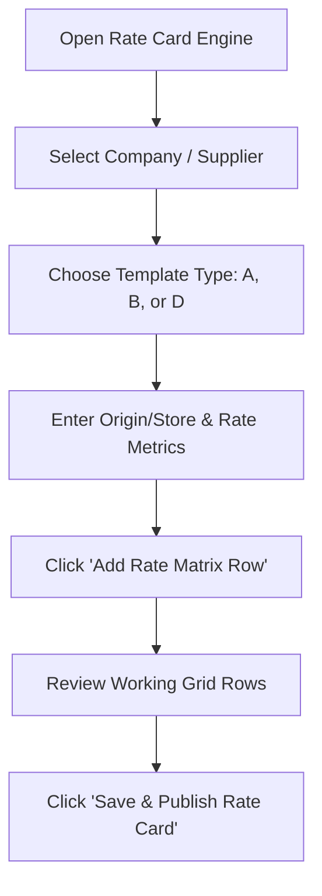

# TRANSITNODE CORE PLATFORM — PRODUCTION USER MANUAL & DEMO STORYBOARD
**Document Version:** 2.4.0  
**Target Audience:** Enterprise Clients, System Administrators, Fleet Operators, Accountants & Video Production Teams  
**Platform URL:** `https://transitnode.prohitcoretech.com` / Tenant Subdomains: `[subdomain].transitnode.prohitcoretech.com`  

---

## EXECUTIVE OVERVIEW

TransitNode Core Platform is an end-to-end, multi-tenant logistics management and transport ERP solution designed for enterprise fleet operators, third-party logistics (3PL) providers, and transport management teams. 

This manual serves two primary operational objectives:
1. **Official Operational User Guide:** Step-by-step instructions for tenant onboarding, fleet tracking, driver compliance, dynamic rate card management, run sheet trip logging, billing verification, and multi-format MIS export generation.
2. **Visual Storyboard for Demo Video Recording:** Structured visual capture callouts (URL, UI element to highlight, caption, and screenshot path) paired with an exact 3-minute sequential walkthrough script for video production teams.

---

## TABLE OF CONTENTS

1. [Public Landing Page & Tenant Onboarding Flow](#1-public-landing-page--tenant-onboarding-flow)
   - 1.1 Landing Page Navigation & Feature Highlights
   - 1.2 Subscription Tier Selector & Pricing Breakdown
   - 1.3 Tenant Registration & Free Trial Onboarding Form
   - 1.4 Automated Workspace Provisioning & Redirect Pipeline
2. [Workspace Architecture & Multi-Tenant Setup](#2-workspace-architecture--multi-tenant-setup)
   - 2.1 Multi-Tenant Subdomain Model (`tenant.transitnode.prohitcoretech.com`)
   - 2.2 Sister Company & Sub-Workspace Initialization
   - 2.3 Tenant Branding & Customization Engine
3. [Master Admin & Tenant Admin Control Center](#3-master-admin--tenant-admin-control-center)
   - 3.1 Master Overview & Tenant Directory (`/admin`)
   - 3.2 Company & Vehicle Master Configuration
   - 3.3 Driver Master & Profile Management
   - 3.4 User Management & Role-Based Access Control (RBAC)
4. [Dynamic Rate Card Configuration Engine](#4-dynamic-rate-card-configuration-engine)
   - 4.1 Supported Billing Models Architecture
   - 4.2 Route-Based Matrix (Origin-Destination Grid / TEMPLATE_A)
   - 4.3 Store / Zone Matrix (Hub-to-Store Grid / TEMPLATE_B)
   - 4.4 Flat / Metric Base Rates & Surcharges (TEMPLATE_D & Global/Vendor Cards)
   - 4.5 Step-by-Step Guide to Adding & Updating Rate Cards
5. [Fleet Operations & Operator Workflow (Operator Portal)](#5-fleet-operations--operator-workflow-operator-portal)
   - 5.1 Real-Time Daily Run Sheet Logging & Trip Entry
   - 5.2 Dynamic Form Fields & Odometer Calculation Engine
   - 5.3 Editing, Submitting, Filtering & Locking Trip Entries
6. [Finance, Billing & Accountant Workflow (Accountant Portal)](#6-finance-billing--accountant-workflow-accountant-portal)
   - 6.1 Accountant Audit Queue & Trip Verification
   - 6.2 Freight Charges & Tax Engines (Forward GST & RCM)
   - 6.3 Consolidated Supplier Billing & Master Invoice Generation
   - 6.4 Automated Excel & Tally Export Engine (Flipkart MIS, Dua Lima MIS, Sales Register, Tally XML)
7. [Compliance Vault & Document Management](#7-compliance-vault--document-management)
   - 7.1 Vehicle Compliance Tracking (PUC, Insurance, Fitness, Permits)
   - 7.2 Driver Compliance & Identity Verification
   - 7.3 Real-Time Expiry Alert Indicators & Warning Triggers
8. [End-to-End Walkthrough Script (For Demo Video Recording)](#8-end-to-end-walkthrough-script-for-demo-video-recording)
   - 8.1 Video Recording Technical Checklist
   - 8.2 Step-by-Step 3-Minute Screen Recording Storyboard Script (Steps 01 - 10)

---

## 1. PUBLIC LANDING PAGE & TENANT ONBOARDING FLOW

### 1.1 Landing Page Navigation & Feature Highlights
The public landing page introduces visitors to the TransitNode ecosystem, showcasing automated fleet telematics, rate card calculation, compliance vaulting, and multi-format billing capabilities.

#### Navigation Menu & Header Options
- **Brand Logo:** Redirects to homepage root `/`.
- **Overview Modal:** Displays platform architecture and features breakdown.
- **Pricing Portal:** Quick link to pricing cards section.
- **Partner Portal:** Form for logistics partners and fleet owners.
- **Contact Us:** Support inquiry modal.
- **Sign In / Registration CTA:** Triggers modal windows for system login and free trial signup.

> **📸 SCREENSHOT CAPTURE:**
> - **URL / View:** `https://transitnode.prohitcoretech.com/`
> - **Element to Highlight:** `Header Navigation & Hero Section CTA Button "Start 14-Day Free Trial"`
> - **Caption:** `Public Landing Page displaying platform capabilities and primary onboarding entry point.`
> ``

---

### 1.2 Subscription Tier Selector & Pricing Breakdown
TransitNode provides transparent, tiered subscription packages scaled to fleet size and features required.

| Tier Name | Max Vehicles | Max Sister Companies | Custom Subdomain | Compliance Vault | Automated MIS Exports | Dedicated Support |
| :--- | :---: | :---: | :---: | :---: | :---: | :---: |
| **TRIAL** | Up to 5 | 1 | Yes | Standard | Basic CSV | Community |
| **SILVER** | Up to 25 | 2 | Yes | Full Vault | Standard Excel | Email Support |
| **GOLD** | Up to 100 | 5 | Yes | Full Vault + Alerts | Flipkart / Dua Lima MIS | Priority Phone |
| **PLATINUM** | Unlimited | 15 | Yes | Full Vault + Automated | Full MIS + Tally XML | Dedicated Manager |
| **ENTERPRISE** | Custom | Unlimited | Custom Domain | Dedicated Vault | Custom Formats | 24/7 SLA |

#### User Instructions: Selecting a Plan
1. Scroll down to the **Pricing Cards** section on the landing page.
2. Toggle between **Monthly** and **Annual** billing cycles.
3. Click on the **"Select Plan"** button under your desired tier (e.g., Gold Plan). This pre-populates the registration form with your chosen tier.

> **📸 SCREENSHOT CAPTURE:**
> - **URL / View:** `https://transitnode.prohitcoretech.com/#pricing`
> - **Element to Highlight:** `Pricing Tier Cards Grid & Plan Selection Buttons`
> - **Caption:** `Subscription Tier Matrix displaying plan details, feature caps, and pricing.`
> ``

---

### 1.3 Tenant Registration & Free Trial Onboarding Form
New logistics companies initiate self-service onboarding via the **"Start Free Trial"** modal window (`RegisterModal.jsx`).

#### Onboarding Form Fields Breakdown

| Field Name | Input Type | Validation Rules | Description |
| :--- | :--- | :--- | :--- |
| **Company Name** | Text Input | Required, min 3 chars | Legal business name (e.g., `Apex Logistics Pvt Ltd`). |
| **Workspace Subdomain (Slug)** | Text Input | Required, alphanumeric, lowercase | Custom subdomain prefix (e.g., `apex`). URL will become `apex.transitnode.prohitcoretech.com`. |
| **Admin Full Name** | Text Input | Required | Name of the primary tenant administrator. |
| **Registered Mobile Number** | Tel Input | Required, 10-digit numeric | Phone number for login verification & SMS alerts. |
| **Admin Email Address** | Email Input | Required, valid email format | Work email address used for login and notifications. |
| **Account Password** | Password | Required, min 8 chars | Master password for tenant admin account. |
| **Company Address** | Textarea | Required | Head office physical address for billing & tax invoices. |
| **Subscription Plan** | Dropdown | Pre-selected from tier card | Default: `TRIAL` (14 days free access). |

#### Step-by-Step Signup Procedure:
1. Click **"Start 14-Day Free Trial"** on the top right header or pricing section.
2. Complete all required company and administrator input fields.
3. Review and accept the **Terms of Service** and **Privacy Policy**.
4. Click **"Create Workspace & Launch Trial"**.

> **📸 SCREENSHOT CAPTURE:**
> - **URL / View:** `https://transitnode.prohitcoretech.com/ (Modal Open)`
> - **Element to Highlight:** `RegisterModal Form Container & Workspace Subdomain Input Field`
> - **Caption:** `Tenant Onboarding Form capturing company details, admin credentials, and workspace slug.`
> ``

---

### 1.4 Automated Workspace Provisioning & Redirect Pipeline
Upon form submission, the TransitNode backend performs the following automated provisioning pipeline:
1. **Tenant Record Creation:** Generates a isolated tenant ID, database tenant scope, and initial workspace settings.
2. **Subdomain Routing:** Registers the subdomain slug (e.g., `apex.transitnode.prohitcoretech.com`).
3. **Master Admin Account Setup:** Creates the primary `TENANT_ADMIN` user account.
4. **Default Rate Cards & Settings:** Seeds baseline vehicle types, rate templates, and default system preferences.
5. **Token Generation & Redirect:** Issues JWT authentication token and automatically redirects the user to their newly created tenant dashboard URL.

> **📸 SCREENSHOT CAPTURE:**
> - **URL / View:** `https://apex.transitnode.prohitcoretech.com/login`
> - **Element to Highlight:** `Subdomain URL Bar & Tenant Specific Dashboard Landing Page`
> - **Caption:** `Automated tenant workspace redirection following successful provisioning.`
> ``

---

## 2. WORKSPACE ARCHITECTURE & MULTI-TENANT SETUP

### 2.1 Multi-Tenant Subdomain Model (`tenant.transitnode.prohitcoretech.com`)
TransitNode operates on a strict multi-tenant architecture ensuring complete data isolation, customized routing, and security.

- **Master Admin Portal:** Accessible at `https://masteradmin.transitnode.prohitcoretech.com` (or `masteradmin.localhost:3001` in local development).
- **Tenant Workspaces:** Accessible at `https://[subdomain].transitnode.prohitcoretech.com` (e.g., `https://dua.transitnode.prohitcoretech.com`).
- **Data Isolation:** All database queries in MongoDB/DuckDB enforce tenant boundary checks (`tenantId`), preventing cross-tenant data leaks.

---

### 2.2 Sister Company & Sub-Workspace Initialization
Enterprise tenants often manage multiple operating entities, transport subsidiaries, or regional hubs under a single account.

#### Creating a Sister Company / Sub-Workspace (`Company.js` Model)
1. Navigate to **Admin Dashboard > Settings > Workspace Management**.
2. Click **"Add Sister Company / Workspace"**.
3. Complete the input form:
   - **Company Name:** Legal name of the subsidiary (e.g., `Apex Express Logistics`).
   - **GSTIN:** 15-character Goods and Services Tax Identification Number.
   - **PAN Number:** 10-character Permanent Account Number.
   - **Registered Address:** Full postal address.
   - **State & State Code:** Billing state details for GST auto-calculation.
   - **Contact Phone:** Official contact number.
4. Click **"Save Sister Company"**.

> **📸 SCREENSHOT CAPTURE:**
> - **URL / View:** `https://[subdomain].transitnode.prohitcoretech.com/admin`
> - **Element to Highlight:** `Sister Company Creation Modal & GSTIN Input Field`
> - **Caption:** `Sister Company & Sub-Workspace Configuration Panel.`
> ``

---

### 2.3 Tenant Branding & Customization Engine
Tenants can customize the platform appearance and document headers to reflect their brand identity (`TenantBrandingConfigurator.jsx`).

#### Customizable Parameters:
- **Company Logo:** Upload PNG/JPEG logo for dashboard headers and printed tax invoices.
- **Primary Brand Hex Color:** Define dominant color (e.g., `#0088FE` or `#1E293B`) for UI buttons and header accents.
- **Custom Invoice Header Text:** Specific tax terms, tagline, or branch details.
- **Driver Mobile App Enforcement Toggle:** Require driver smartphone app pairing for trip dispatch.

> **📸 SCREENSHOT CAPTURE:**
> - **URL / View:** `https://[subdomain].transitnode.prohitcoretech.com/admin#branding`
> - **Element to Highlight:** `Logo Upload Dropzone & Color Picker Control`
> - **Caption:** `Tenant Branding & Document Styling Configurator.`
> ``

---

## 3. MASTER ADMIN & TENANT ADMIN CONTROL CENTER

### 3.1 Master Overview & Tenant Directory (`/admin`)
The Master Admin Control Center (`MasterAdminDashboard.jsx`) is utilized by platform administrators to monitor global system health, manage tenant subscriptions, process manual onboardings, and track revenue metrics.

#### Master Dashboard Tabs & Features:
1. **Overview Analytics:** System-wide active tenants, total vehicle count, monthly revenue, active driver stats.
2. **Tenants Directory:** Searchable table listing all registered tenant accounts, subdomain slugs, current subscription plans, trial expiration dates, and activation toggles.
3. **Manual Onboarding Panel:** Allows Master Admins to manually provision enterprise client workspaces without credit card checks.
4. **Subscription Pricing & Coupon Manager:** Add, edit, or toggle discount coupons and edit plan features.
5. **Global Financial Transactions Log:** Audit trail of subscription transactions and billing receipts.

> **📸 SCREENSHOT CAPTURE:**
> - **URL / View:** `https://masteradmin.transitnode.prohitcoretech.com/`
> - **Element to Highlight:** `Tenants Directory Table & "Manual Onboard Tenant" Action Button`
> - **Caption:** `Master Admin Control Center showing global tenant directory and system metrics.`
> ``

---

### 3.2 Company & Vehicle Master Configuration
Fleet vehicles are configured under **Admin Dashboard > Fleet Management > Vehicle Master** (`Device.js` model).

#### Adding a New Vehicle to Fleet:

| Field Name | Type | Description / Options |
| :--- | :--- | :--- |
| **Vehicle Registration Number** | Text Input | Mandatory (e.g., `MH-12-PQ-4567`). |
| **Vehicle Type** | Dropdown | `Tata Ace`, `Tata 407`, `14-Ft Container`, `17-Ft Container`, `20-Ft Container`, `32-Ft 7T`, `32-Ft 9T`, `32-Ft 10T`, `32-Ft 15T`, `Custom`. |
| **Custom Vehicle Type** | Text Input | Appears if "Custom" selected. |
| **Hardware IMEI / Tracker ID** | Text Input | Unique GPS telematics hardware ID. |
| **Assigned Driver** | Dropdown | Select driver profile from Driver Master. |
| **Fitness Certificate Expiry Date** | Date Picker | Expiry date for vehicle fitness document. |
| **Current Vehicle Status** | Dropdown | `YARD` (Available), `ON_TRIP`, `IN_MAINTENANCE`, `DECOMMISSIONED`. |
| **Vehicle Document Upload** | File Upload | PDF/Image upload for RC (Registration Certificate). |

#### Step-by-Step Vehicle Registration:
1. Open **Admin Dashboard > Vehicle Master**.
2. Click **"+ Register New Vehicle"**.
3. Enter Vehicle Number, select Vehicle Type, and input hardware IMEI if applicable.
4. Attach RC document copy and set fitness expiry date.
5. Click **"Save Vehicle Master Record"**.

> **📸 SCREENSHOT CAPTURE:**
> - **URL / View:** `https://[subdomain].transitnode.prohitcoretech.com/admin#vehicles`
> - **Element to Highlight:** `Vehicle Master Entry Form & Hardware IMEI Input Field`
> - **Caption:** `Vehicle Master Entry Form for registering fleet trucks and hardware telematics.`
> ``

---

### 3.3 Driver Master & Profile Management
Driver profiles (`Driver.js` model) store contact details, license expiration dates, document verification files, and vehicle assignment history.

#### Driver Profile Fields:
- **Full Driver Name:** Mandatory string field.
- **Mobile Phone Number:** Contact number for SMS dispatch alerts.
- **Driving License Number:** Official DL number (e.g., `MH1420190012345`).
- **License Expiry Date:** Used by Compliance Vault for renewal alerts.
- **Driver Status:** `AVAILABLE`, `ON_TRIP`, `INACTIVE`.
- **Document Attachments:** Driving license front/back copies and Aadhaar/PAN ID proofs.

#### Adding a Driver:
1. Navigate to **Admin Dashboard > Driver Management**.
2. Click **"+ Add Driver Profile"**.
3. Fill in personal details, license details, and upload license scan.
4. Click **"Save Driver Profile"**.

> **📸 SCREENSHOT CAPTURE:**
> - **URL / View:** `https://[subdomain].transitnode.prohitcoretech.com/admin#drivers`
> - **Element to Highlight:** `Driver Profile Form & License Expiry Date Selector`
> - **Caption:** `Driver Master Profile Management and License Document Upload.`
> ``

---

### 3.4 User Management & Role-Based Access Control (RBAC)
Tenant Administrators can create staff user accounts (`User.js` model) and assign granular permissions.

#### Supported User Roles & Permissions Matrix

| Role Name | Access Level & Permissions |
| :--- | :--- |
| **TENANT_ADMIN** | Full administrative access: System settings, rate cards, user management, billing, exports, compliance. |
| **OPERATOR** / **OPERATION_EXECUTIVE** | Daily operations access: Log daily run sheet entries, dispatch trips, update odometer readings, view map tracking. |
| **ACCOUNTANT** | Financial access: Audit pending trip logs, verify freight rates, compute fuel/toll allowances, issue master invoices, generate Flipkart/Dua Lima MIS exports. |
| **RECEPTIONIST** | Gate operations access: Log vehicle intake/gate entry timestamps, verify visitor/driver tokens. |

#### Step-by-Step User Account Creation:
1. Go to **Admin Dashboard > User Management**.
2. Click **"+ Invite User Account"**.
3. Input Full Name, Email Address, Phone Number, Temporary Password, and Role selection (`OPERATOR` or `ACCOUNTANT`).
4. Click **"Create & Send Invitation"**.

> **📸 SCREENSHOT CAPTURE:**
> - **URL / View:** `https://[subdomain].transitnode.prohitcoretech.com/admin#users`
> - **Element to Highlight:** `User Role Dropdown Selection & User List Table`
> - **Caption:** `User Management Panel showcasing role assignment (Operator, Accountant, Admin).`
> ``

---

## 4. DYNAMIC RATE CARD CONFIGURATION ENGINE

### 4.1 Supported Billing Models Architecture
The TransitNode Dynamic Rate Engine (`RateCard.js` & `VendorRateCard.js`) supports 3 primary billing models to accommodate enterprise contract requirements:

1. **Route-Based (Origin-Destination Matrix / TEMPLATE_A):** Fixed rates between specific point-to-point hubs, with extra KM and detention hourly penalties.
2. **Store / Zone Matrix (Hub-to-Store Grid / TEMPLATE_B):** Grid mapping central distribution hubs to retail store codes across different vehicle payload tiers.
3. **Flat / Metric Base Rates & Surcharges (TEMPLATE_D & Vendor Cards):** Volumetric/weight base pricing, fuel surcharge formulas, and fixed monthly vehicle availability contracts.

---

### 4.2 Route-Based Matrix (Origin-Destination Grid / TEMPLATE_A)
Ideal for scheduled point-to-point trunk routes and inter-city transfers.

#### Input Attributes (TEMPLATE_A Grid):
- **Origin (From):** Source distribution hub (e.g., `Bhiwandi Hub`).
- **Destination (To):** Target hub/city (e.g., `Pune Chakan Hub`).
- **Vehicle Type:** Associated vehicle model (e.g., `20-Ft Container`).
- **Billing Type:** `Fixed Rate` or `Per KM Rate`.
- **Base Distance / Fixed KMs:** Baseline distance cap included in rate (e.g., `160 KMs`).
- **12-Hour Shift Rate:** Base cost for 12-hour deployment (e.g., `₹4,500`).
- **24-Hour Shift Rate:** Base cost for full-day deployment (e.g., `₹7,200`).
- **Extra KM Rate:** Rate charged per kilometer beyond fixed KMs (e.g., `₹22 / KM`).
- **Extra Hour Rate:** Rate charged per hour beyond shift time (e.g., `₹150 / Hr`).
- **Detention Charges:** Daily or hourly detention waiting penalty.

> **📸 SCREENSHOT CAPTURE:**
> - **URL / View:** `https://[subdomain].transitnode.prohitcoretech.com/admin#ratecards`
> - **Element to Highlight:** `Template A Route Grid Form & Extra KM Rate Input Field`
> - **Caption:** `Route-Based Rate Card Configuration Grid (TEMPLATE_A).`
> ``

---

### 4.3 Store / Zone Matrix (Hub-to-Store Grid / TEMPLATE_B)
Designed for retail supply chain operations (e.g., grocery retail, e-commerce hyper-local distribution) connecting central warehouses to retail outlet networks.

#### Input Attributes (TEMPLATE_B Grid):
- **Store Code & Store Name:** Unique identifier and title (e.g., `STR-104 - Flipkart Hub Thane`).
- **Location, City, State & Zone:** Regional classification.
- **Vehicle Type Multi-Truck Rate Columns:**
  - `Tata Ace Rate`
  - `Tata 407 Rate`
  - `14-Ft Container Rate`
  - `17-Ft Container Rate`
  - `20-Ft Container Rate`
  - `32-Ft 7-Ton Rate`
  - `32-Ft 9-Ton Rate`
  - `32-Ft 10-Ton Rate`
  - `32-Ft 15-Ton Rate`
- **Detention Cost Per Day:** Penalty for store unloading delay.
- **Local / Out-of-State Point Charges:** Additional drop point surcharges.

> **📸 SCREENSHOT CAPTURE:**
> - **URL / View:** `https://[subdomain].transitnode.prohitcoretech.com/admin#ratecards`
> - **Element to Highlight:** `Multi-Truck Vehicle Rate Columns Table Header`
> - **Caption:** `Store / Zone Multi-Truck Rate Card Grid (TEMPLATE_B).`
> ``

---

### 4.4 Flat / Metric Base Rates & Surcharges (TEMPLATE_D & Global/Vendor Cards)
Supports volumetric metrics, ad-hoc spot contracts, and vendor payout rate cards.

#### Key Parameters:
- **Base Freight Rate per KG:** Metric freight pricing.
- **Volumetric Divisor:** Standard cubic conversion factor (default `5000` for `(L x W x H in cm) / 5000`).
- **Fuel Surcharge Rate (%):** Percentage added to base freight linked to diesel index fluctuation (e.g., `5%`).
- **Agreed Monthly Deployment Days:** Baseline contracted days (e.g., `26 Days / Month`).
- **Deployment Hours per Shift:** Daily operational window (e.g., `12 Hours`).

> **📸 SCREENSHOT CAPTURE:**
> - **URL / View:** `https://[subdomain].transitnode.prohitcoretech.com/admin#ratecards`
> - **Element to Highlight:** `Volumetric Divisor & Fuel Surcharge Percentage Input Controls`
> - **Caption:** `Metric Base Rates & Fuel Surcharge Configuration Panel.`
> ``

---

### 4.5 Step-by-Step Guide to Adding & Updating Rate Cards

1. Go to **Admin Dashboard > Rate Card Configuration**.
2. Select target **Sister Company** or **Supplier** from the header filter dropdown.
3. Select **Template Type** (`TEMPLATE_A`, `TEMPLATE_B`, or `TEMPLATE_D`).
4. Fill in the row matrix input fields (Origin/Store, rates, extra KM/hr rates, detention).
5. Click **"+ Add Row to Matrix"**.
6. Repeat step 4-5 for all required routes or stores.
7. Click **"Save & Publish Rate Card"**. The system immediately applies these rates to new trip entries logged by operators.

> **📸 SCREENSHOT CAPTURE:**
> - **URL / View:** `https://[subdomain].transitnode.prohitcoretech.com/admin#ratecards`
> - **Element to Highlight:** `"Save & Publish Rate Card" Button & Configured Rows Count`
> - **Caption:** `Publishing updated rate card rules to tenant live calculation engine.`
> ``

---

## 5. FLEET OPERATIONS & OPERATOR WORKFLOW (OPERATOR PORTAL)

### 5.1 Real-Time Daily Run Sheet Logging & Trip Entry
Fleet Operators utilize the **Daily Run Sheet Portal** (`DailyRunSheet.jsx`) to log live trips, vehicle movements, starting/closing odometer readings, and toll/detention expenses.

> **📸 SCREENSHOT CAPTURE:**
> - **URL / View:** `https://[subdomain].transitnode.prohitcoretech.com/operator/runsheet`
> - **Element to Highlight:** `Daily Run Sheet Entry Form & Odometer Fields`
> - **Caption:** `Operator Portal Daily Run Sheet Log Entry Interface.`
> ``

---

### 5.2 Dynamic Form Fields & Odometer Calculation Engine

#### Operator Input Fields Breakdown

| Field Name | Input Type | Description & Behavior |
| :--- | :--- | :--- |
| **Trip Date** | Date Picker | Date of dispatch (defaults to current date). |
| **Source Hub Name** | Text / Select | Origin warehouse or distribution hub. Dynamic label updates based on selected supplier. |
| **Client / Vendor Name** | Select / Text | Client company requesting transport (e.g., `Flipkart Internet Pvt Ltd`). |
| **Supplier Name** | Select Dropdown | Supplier contract associated with trip. Auto-populates supported billing cycles. |
| **Vehicle Registration Number**| Select Dropdown | Vehicle selected from active Vehicle Master list. |
| **Vehicle Type** | Text (Auto) | Pre-filled automatically based on vehicle choice. |
| **Parent Vehicle Number** | Text Input | Additional trailer or parent tractor number if applicable. |
| **Transporter / Vendor Name** | Text Input | Sub-contractor transport vendor name. |
| **Vehicle Ownership Type** | Select Dropdown | `Adhoc`, `Leased`, `Owned Fleet`. |
| **Driver Type** | Select Dropdown | `Contract / Vendor Driver`, `In-house Employee`. |
| **Start Odometer Reading** | Number Input | Kilometers reading at dispatch time (e.g., `45200`). |
| **End Odometer Reading** | Number Input | Kilometers reading upon trip completion (e.g., `45420`). |
| **Distance Travelled (KM)** | Number (Auto) | **Calculated automatically:** `End Odometer - Start Odometer` (`220 KM`). |
| **Movement Type** | Select Dropdown | `Inter-City`, `Intra-City`, `Store Delivery`, `Hub Return`. |
| **Freight Charge (₹)** | Number Input | Base freight amount computed or manually logged. |
| **DCM / Halting Charges (₹)**| Number Input | Detention / loading wait penalty amount. |
| **Toll Expense (₹)** | Number Input | Highway toll receipts total amount. |
| **Total Amount (₹)** | Number (Auto) | **Calculated automatically:** `Freight + DCM Charges + Toll Expense`. |

#### Automatic Calculation Formulas:
$$\text{Distance Travelled} = \max(0, \text{End Odometer} - \text{Start Odometer})$$
$$\text{Total Amount} = \text{Freight Charge} + \text{DCM Charges} + \text{Toll Expense}$$

---

### 5.3 Editing, Submitting, Filtering & Locking Trip Entries

#### Submitting a Trip Log:
1. Complete all trip entry input fields in the run sheet form.
2. Verify automatically computed Distance Travelled and Total Amount.
3. Click **"Save Run Sheet Entry"**. The record appears immediately in the lower log table.

#### Editing & Updating Entries:
1. Locate the entry in the Run Sheet Log Table.
2. Click the **"Edit"** icon action button. The form auto-scrolls to the top with fields pre-filled.
3. Make necessary corrections and click **"Update Run Sheet Entry"**.

#### Filtering & CSV Export:
- Use the **Start Date**, **End Date**, and **Search Keyword** filters to locate specific vehicle logs.
- Click **"Export Filtered Log (CSV)"** to generate a quick local operator snapshot sheet.

> **📸 SCREENSHOT CAPTURE:**
> - **URL / View:** `https://[subdomain].transitnode.prohitcoretech.com/operator/runsheet`
> - **Element to Highlight:** `Run Sheet Log Table & Action Buttons (Edit / Delete / Export)`
> - **Caption:** `Live Run Sheet Log Table displaying submitted trips and quick filters.`
> ``

---

## 6. FINANCE, BILLING & ACCOUNTANT WORKFLOW (ACCOUNTANT PORTAL)

### 6.1 Accountant Audit Queue & Trip Verification
Accountants access the **Billing & Finance Portal** (`BillingDashboard.jsx` & `FinancialLedger.jsx`) to review pending operator trip logs, cross-verify trip distances against rate card matrices, approve expenses, and trigger invoice generation.

#### Audit Workflow Steps:
1. Open **Accountant Portal > Pending Verification Queue**.
2. Select a pending trip log to inspect trip details, driver advance receipts, fuel voucher amounts, and toll charges.
3. Compare logged kilometers and vehicle type against rate card rules.
4. Click **"Verify & Approve Trip"** or **"Flag for Adjustment"**.

> **📸 SCREENSHOT CAPTURE:**
> - **URL / View:** `https://[subdomain].transitnode.prohitcoretech.com/accountant/billing`
> - **Element to Highlight:** `Pending Audit Queue Table & "Verify & Approve" Action Button`
> - **Caption:** `Accountant Verification Queue for cross-checking trip logs against rate cards.`
> ``

---

### 6.2 Freight Charges & Tax Engines (Forward GST & RCM)
The finance engine supports complex logistics taxation rules (`billController.js`).

#### Tax & Allowance Computations:
- **Base Freight Calculation:** Computed based on matched rate card row (Fixed rate or `Distance Travelled x Extra KM Rate`).
- **Fuel Voucher & Driver Advance Deductions:** Subtracted from driver payout.
- **GST Rate Configuration:** Standard `18%` (CGST 9% + SGST 9% or IGST 18%).
- **Reverse Charge Mechanism (RCM):** Toggle RCM if GTA (Goods Transport Agency) tax liability shifts to the recipient party. RCM entries flag tax as zero on invoice while outputting RCM ledger notes.
- **Sarthak LR Specific Charges Breakdown:**
  - Processing Fee (`₹150`)
  - Fuel Surcharge (`₹`)
  - ROV / FOD Charges (`₹`)
  - Handling Charges (`₹200`)
  - COD / DOD Surcharges (`₹`)
  - Special Delivery Surcharge (`₹`)

> **📸 SCREENSHOT CAPTURE:**
> - **URL / View:** `https://[subdomain].transitnode.prohitcoretech.com/accountant/billing#tax`
> - **Element to Highlight:** `RCM Toggle Switch & GST Calculation Summary Box`
> - **Caption:** `Tax Engine Interface displaying Forward GST and RCM toggle controls.`
> ``

---

### 6.3 Consolidated Supplier Billing & Master Invoice Generation
Accountants can consolidate multiple daily trip logs into single periodic master invoices for corporate clients.

#### Steps to Generate Master Invoice:
1. Switch to **Consolidated Billing View** on the Billing Dashboard.
2. Select **Client / Supplier** and specify date range (e.g., Monthly billing cycle).
3. Select all verified unbilled trip logs from the selection checklist.
4. Click **"Generate Master Consolidated Invoice"**.
5. The system computes aggregated subtotals, tax amounts, generates a unique Master Invoice Number, and produces printable PDF views.

> **📸 SCREENSHOT CAPTURE:**
> - **URL / View:** `https://[subdomain].transitnode.prohitcoretech.com/accountant/billing#consolidated`
> - **Element to Highlight:** `Trip Selection Checklist & "Generate Master Invoice" Action Button`
> - **Caption:** `Consolidated Billing Generator combining multiple daily trips into a Master Invoice.`
> ``

---

### 6.4 Automated Excel & Tally Export Engine (Flipkart MIS, Dua Lima MIS, Sales Register, Tally XML)
TransitNode features a specialized export controller (`exportController.js`) capable of generating client-customized MIS Excel spreadsheets and accounting system XML files.

#### Supported Export Formats & Specifications:

| Export Format Name | File Extension | Target Audience / Use Case | Output Data Structure |
| :--- | :---: | :--- | :--- |
| **Flipkart MIS Sheet** | `.xlsx` | E-commerce Client Reconciliation | Standardized Flipkart vendor column layout: Date, Tracking/LR Number, Source Hub, Vehicle Type, Distance, Freight, CGST, SGST, Total Value, RCM Flag. |
| **Dua Lima MIS Sheet** | `.xlsx` | Enterprise Logistics Reporting | Detailed trip audit breakdown sheet formatted to Dua Lima contract requirements. |
| **Freight Sales Register** | `.xlsx` | Internal Finance & Audit | Full financial ledger listing subtotal, tax breakdown, party ledger names, and payment status. Styled header (`Slate-500`), right-aligned formatted currency numbers (`0.00`). |
| **Tally ERP / Prime XML** | `.xml` | Tally Accounting Software | Standard Tally XML Envelope (`VCHTYPE="Sales"`), importing vouchers directly with `PARTYLEDGERNAME`, `Freight Income`, `CGST`, and `SGST` ledger posts. |

#### Step-by-Step Export Generation:
1. Navigate to **Accountant Dashboard > Export Center**.
2. Select date range using the **Start Date** and **End Date** controls.
3. Choose desired format:
   - Click **"Export Flipkart MIS (.xlsx)"**
   - Click **"Export Dua Lima MIS (.xlsx)"**
   - Click **"Export Freight Sales Register (.xlsx)"**
   - Click **"Export Tally XML Vouchers (.xml)"**
4. The file compiles instantly on the server and downloads directly to your local workstation.

> **📸 SCREENSHOT CAPTURE:**
> - **URL / View:** `https://[subdomain].transitnode.prohitcoretech.com/accountant/billing#export`
> - **Element to Highlight:** `MIS Export Buttons Grid (Flipkart, Dua Lima, Tally XML)`
> - **Caption:** `Automated MIS & Tally Export Engine Interface.`
> ``

---

## 7. COMPLIANCE VAULT & DOCUMENT MANAGEMENT

### 7.1 Vehicle Compliance & Document Vault
The **Compliance Vault** (`ComplianceVault.jsx` & `ComplianceDocument.js`) tracks critical vehicle regulatory documents to prevent statutory fines and operational downtime.

#### Tracked Vehicle Compliance Documents:
- **PUC (Pollution Under Control) Certificate:** Mandatory emissions compliance.
- **Vehicle Insurance Policy:** Comprehensive motor insurance coverage.
- **Fitness Certificate:** Transport department roadworthiness certificate.
- **National / State Permits:** Interstate haulage permits.
- **RC (Registration Certificate):** Vehicle ownership document.

> **📸 SCREENSHOT CAPTURE:**
> - **URL / View:** `https://[subdomain].transitnode.prohitcoretech.com/admin/compliance`
> - **Element to Highlight:** `Vehicle Compliance Status Badges & Document Upload Dropzone`
> - **Caption:** `Vehicle Compliance Vault monitoring PUC, Insurance, and Fitness certificates.`
> ``

---

### 7.2 Driver Compliance & Identity Verification
Ensures all active drivers meet regulatory identity and driving authorization standards.

#### Tracked Driver Compliance Items:
- **Driving License (DL):** Expiry tracking for commercial driving licenses.
- **Identity Proofs:** Aadhaar Card, PAN Card, and permanent address verification.
- **Driver Background Verification:** Police clearance documentation status.

> **📸 SCREENSHOT CAPTURE:**
> - **URL / View:** `https://[subdomain].transitnode.prohitcoretech.com/admin/compliance#drivers`
> - **Element to Highlight:** `Driver License Expiry Tracker & Document Preview Modal`
> - **Caption:** `Driver Compliance Vault tracking driver license expiry dates and identity files.`
> ``

---

### 7.3 Real-Time Expiry Alert Indicators & Warning Triggers
The Compliance Vault features an automated status calculation engine that classifies documents into color-coded status badges:

$$\text{Status} = \begin{cases} \mathbf{EXPIRED} & \text{if } \text{Expiry Date} < \text{Current Date} \\ \mathbf{EXPIRING\_SOON} & \text{if } 0 \le (\text{Expiry Date} - \text{Current Date}) \le 30 \text{ Days} \\ \mathbf{ACTIVE} & \text{if } (\text{Expiry Date} - \text{Current Date}) > 30 \text{ Days} \end{cases}$$

- 🟢 **ACTIVE (Green):** Document valid for more than 30 days.
- 🟡 **EXPIRING SOON (Yellow/Amber):** Expiry within 30 days. Triggers daily dashboard warning banners.
- 🔴 **EXPIRED (Red):** Document has passed expiry date. Automatically flags vehicle in Operator Dispatch portal to prevent trip assignment.

> **📸 SCREENSHOT CAPTURE:**
> - **URL / View:** `https://[subdomain].transitnode.prohitcoretech.com/admin/compliance`
> - **Element to Highlight:** `Color-Coded Status Badges (Red Expired / Amber Expiring Soon)`
> - **Caption:** `Compliance Alert Badges indicating active, expiring soon, and expired documents.`
> ``

---

## 8. END-TO-END WALKTHROUGH SCRIPT (FOR DEMO VIDEO RECORDING)

### 8.1 Video Recording Technical Checklist
Before commencing screen recording for product demo videos, ensure the following setup parameters are met:

- **Resolution:** Screen resolution set to `1920x1080 (1080p FHD)` at `60 FPS`.
- **Browser Window:** Google Chrome operating in full-screen mode (`F11` or `Cmd+Shift+F`), bookmarks bar hidden, extension icons hidden.
- **Audio Setup:** Studio condenser microphone calibrated with zero background noise.
- **Demo Data Seed:** Ensure pre-loaded clean demo data exists (2 Sister Companies, 5 Vehicles, 4 Drivers, 1 Active Rate Card, 10 Logged Trips).

---

### 8.2 Step-by-Step 3-Minute Screen Recording Storyboard Script (Steps 01 - 10)

| Step # | Time Window | View / Screen Route | Screen Action & Cursor Focus | On-Screen Voiceover Script |
| :---: | :---: | :--- | :--- | :--- |
| **01** | `0:00 - 0:15` | Landing Page `https://transitnode.prohitcoretech.com` | Slow scroll through hero section, highlight features, click **"Start 14-Day Free Trial"**. | *"Welcome to TransitNode Core Platform — the enterprise logistics ERP for multi-tenant fleet operators. Let's see how fast a logistics company can start."* |
| **02** | `0:15 - 0:30` | Signup Modal `RegisterModal.jsx` | Fill Company Name (`Apex Logistics`), Subdomain (`apex`), Admin details, and click **"Create Workspace"**. | *"Entering company details and chosen subdomain. In seconds, TransitNode provisions a dedicated, isolated workspace database."* |
| **03** | `0:30 - 0:45` | Redirected Tenant Admin `https://apex.transitnode.prohitcoretech.com/admin` | Show automatic redirect bar, land on Admin Overview, highlight metrics widgets. | *"We are seamlessly redirected to our custom subdomain dashboard. Notice our company metrics, fleet stats, and active workspace switcher."* |
| **04** | `0:45 - 1:05` | Vehicle & Driver Master `https://apex.transitnode.prohitcoretech.com/admin#vehicles` | Click **"Vehicle Master"**, register vehicle `MH-12-PQ-4567` (`14-Ft Container`), attach RC document. | *"Next, we register our fleet vehicles and drivers, attaching telematics hardware IMEIs, RC documents, and license expiry dates."* |
| **05** | `1:05 - 1:30` | Rate Card Configuration `https://apex.transitnode.prohitcoretech.com/admin#ratecards` | Select **TEMPLATE_A**, fill Origin `Bhiwandi`, Destination `Pune`, 12h rate `₹4500`, extra KM `₹22`, click **"Publish Rate Card"**. | *"Here is our dynamic Rate Card engine. We configure route matrices, store grids, extra KM penalties, and fuel surcharges with instant publishing."* |
| **06** | `1:30 - 1:55` | Operator Daily Run Sheet `https://apex.transitnode.prohitcoretech.com/operator/runsheet` | Select vehicle `MH-12-PQ-4567`, enter Start Odo `45200`, End Odo `45420`, verify `220 KM`, submit entry. | *"Over in the Operator Portal, trip dispatches are logged in real time. Notice how distance travelled and total freight amounts auto-calculate instantly."* |
| **07** | `1:55 - 2:20` | Accountant Audit Queue `https://apex.transitnode.prohitcoretech.com/accountant/billing` | Open pending trip queue, review trip `220 KM`, toggle RCM, click **"Verify & Approve Trip"**. | *"In the Accountant Portal, pending trips are audited against rate cards. We can adjust fuel advances, apply Forward GST or RCM, and verify entries."* |
| **08** | `2:20 - 2:40` | MIS Export Center `https://apex.transitnode.prohitcoretech.com/accountant/billing#export` | Click **"Export Flipkart MIS (.xlsx)"** and **"Export Tally XML"**, show downloaded files in tray. | *"With one click, our automated export engine generates Flipkart-formatted MIS sheets, Dua Lima registers, and direct Tally ERP XML vouchers."* |
| **09** | `2:40 - 2:55` | Compliance Vault `https://apex.transitnode.prohitcoretech.com/admin/compliance` | Navigate to Compliance Vault, highlight red/yellow expiry alert badges for PUC/Insurance. | *"Our Compliance Vault proactively monitors PUC, insurance, and license expiry dates, triggering warning alerts before violations occur."* |
| **10** | `2:55 - 3:00` | Landing Page / Contact `https://transitnode.prohitcoretech.com` | Return to landing page header, highlight final contact CTA button. | *"TransitNode Core Platform: Automated fleet operations, dynamic rate engines, and enterprise billing. Start your free trial today!"* |

---

## CONCLUSION & SUPPORT

This User Manual covers all operational aspects of the TransitNode Core Platform. For technical support, custom rate card template creation, or enterprise custom domain integration:

- **Official Support Portal:** `https://transitnode.prohitcoretech.com/contact`
- **Technical Documentation & API Specs:** `https://transitnode.prohitcoretech.com/docs`
- **Customer Care Email:** `support@prohitcoretech.com`
